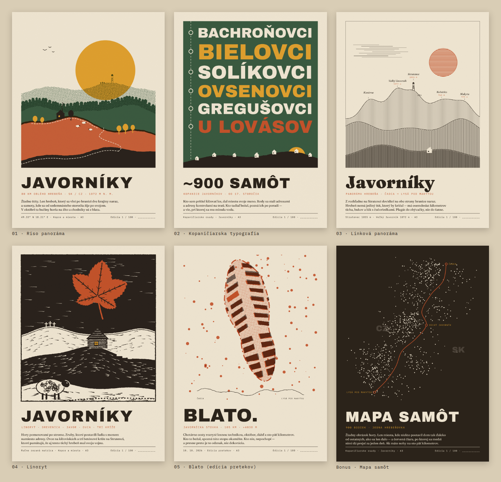

# Javorníky — návrhy plagátov (A3)

Prvá kolekcia trailových plagátov. Päť smerov z briefu + bonus, všetko v riso palete
(`#F0E6D2` `#C4522A` `#E0A02E` `#3A5A40` `#2B231A`).



| # | Návrh | Úroveň produktu | Poznámka |
|---|---|---|---|
| 01 | **Riso panoráma** | Kopce a miesta | vrstvené hrebene, okrové slnko, rozhľadňa + kríže na Stratenci, kopanica, ovce, trasa |
| 02 | **Kopaničiarska typografia** | Kopce a miesta | názvy osád ako „drevorezové písmo“, každý na plnú šírku; kontroly na trase |
| 03 | **Linková panoráma** | Kopce a miesta | rytinové zvislé šrafovanie, popísané vrcholy, „do obývačky“ |
| 04 | **Linoryt** | Kopce a miesta | javorový list, zrubová drevenica, ovca, tri kríže, sekané šrafy |
| 05 | **Blato** | Edícia pretekov | stopa trailovky cez celý formát + drobný profil trate — *názov pretekov až po dohode s organizátorom* |
| ★ | **Mapa samôt** | Kopce a miesta | 900 bodiek + hrebeňovka |

## Súbory

- `svg/` — vektorové predlohy 1000 × 1414 (= A3). Vrstvy sú pomenované ako v Procreate
  skelete z briefu (`01-papier`, `02-slnko`, `03-…hreben`, `07-trasa`, `08-typografia`, `09-zrno`),
  takže sa dajú importovať, vypnúť typografia a prekresliť po svojom.
- `png/` — náhľady.
- `src/generate.py` — generátor (Python, bez závislostí). Skelet (papier · ilustrácia · textový blok · zrno)
  je spoločný, mení sa len ilustrácia → základ šablóny pre budúci generátor z GPX.
- `src/render.mjs` — SVG → PNG cez Playwright/Chromium.

```bash
python3 src/generate.py
node src/render.mjs 1.2     # 1.2 = mierka náhľadu; pre tlač 3.508 → 3508 × 4961 px
```

Písma (Google Fonts, OFL): Archivo Black, Fraunces, IBM Plex Mono.

## Čo treba pred tlačou doplniť / overiť

- **05 Blato** — výškový profil je zatiaľ ilustračný. Nahradiť reálnym z GPX (vrstva 03).
- **Mapa samôt** — rozmiestnenie bodiek a línia hranice sú kompozičná skica, nie reálne dáta.
  Reálne polohy: OSM `place=isolated_dwelling|hamlet` + hranica `admin_level=2` (QGIS / Overpass).
- **03 Linková panoráma** — výšky vrcholov (Kohútka 913, Makyta 923) a poradie po hrebeni overiť v mape;
  tvar hrebeňa je štylizovaný, pre presný profil použiť DEM.
- Príbehové texty sú návrhy — prepíš ich svojím hlasom.
- Ak má byť tlač „drahšia“: vypnúť okrovú a nechať tri farby.
